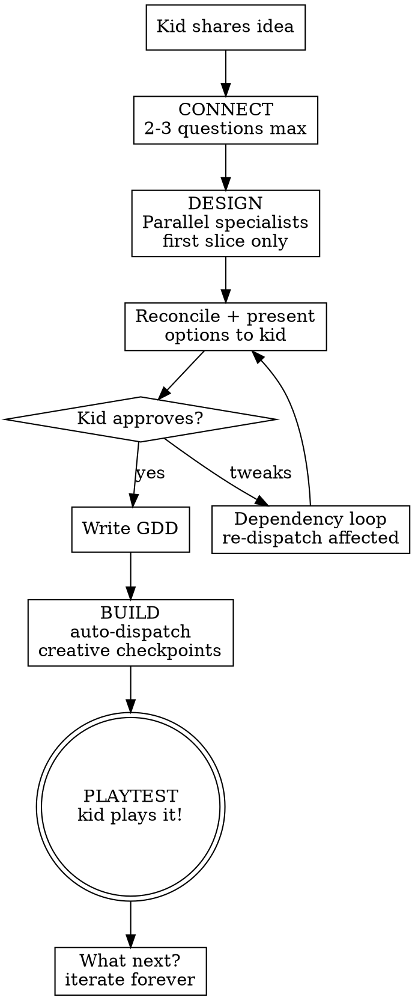
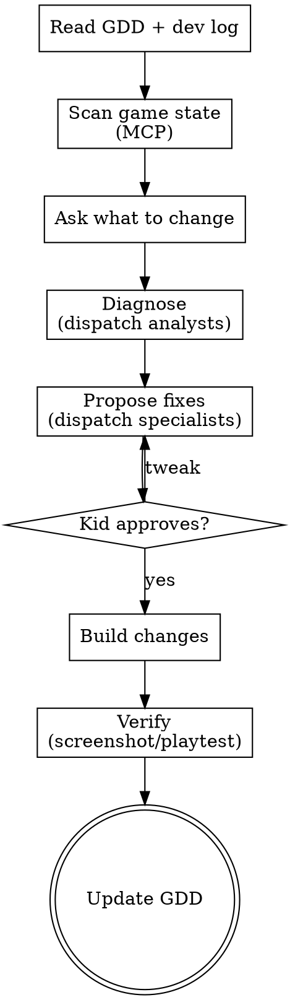

# Game Studio Refactor Implementation Plan

> **For agentic workers:** REQUIRED SUB-SKILL: Use superpowers:subagent-driven-development (recommended) or superpowers:executing-plans to implement this plan task-by-task. Steps use checkbox (`- [ ]`) syntax for tracking.

**Goal:** Refactor the superpowers-roblox skill suite into a modular AI game studio with a `new-game` orchestrator, creative specialist agents, renamed production skills, and a persistent GDD system.

**Architecture:** Two orchestrator entry points (`new-game`, `edit-game`) dispatch creative specialists (`mechanics-designer`, `narrative-designer`, `level-designer`) in parallel during design, then production skills (`build`, `add-asset`, `screenshot`, `review-game`, `review-layout`, `playtest`) during build. A game design document (GDD) persists state across sessions. The orchestrator acts as reconciler — synthesizing parallel outputs and surfacing creative decisions to the kid.

**Tech Stack:** Markdown skills with YAML frontmatter, Roblox Studio MCP tools, Luau helper scripts.

**Spec:** `docs/superpowers/specs/2026-03-26-game-studio-refactor-design.md`

---

## File Structure

### Renamed (directory + contents move together)
- `skills/game-design-audit/` → `skills/review-game/` (SKILL.md + design-theory-reference.md)
- `skills/spatial-flow/` → `skills/review-layout/` (SKILL.md)
- `skills/playtest-audit/` → `skills/playtest/` (SKILL.md)
- `skills/visual-check/` → `skills/screenshot/` (SKILL.md)
- `skills/build-scene/` → `skills/build/` (SKILL.md + room-builder-prompt.md)
- `.claude/commands/game-design-audit.md` → `.claude/commands/review-game.md`
- `.claude/commands/spatial-flow.md` → `.claude/commands/review-layout.md`
- `.claude/commands/playtest-audit.md` → `.claude/commands/playtest.md`
- `.claude/commands/visual-check.md` → `.claude/commands/screenshot.md`
- `.claude/commands/build-scene.md` → `.claude/commands/build.md`

### New files
- `skills/new-game/SKILL.md` — orchestrator for new game creation
- `skills/edit-game/SKILL.md` — orchestrator for existing game iteration
- `skills/mechanics-designer/SKILL.md` — gameplay systems specialist
- `skills/narrative-designer/SKILL.md` — story/atmosphere specialist
- `skills/level-designer/SKILL.md` — pacing/progression specialist
- `.claude/commands/new-game.md` — command entry point
- `.claude/commands/edit-game.md` — command entry point

### Modified files
- `CLAUDE.md` — update all skill/command references
- `README.md` — rewrite for new structure
- `.claude-plugin/plugin.json` — update description
- `.claude-plugin/marketplace.json` — update description
- All renamed SKILL.md files — update internal cross-references

---

### Task 1: Rename existing skill directories

**Files:**
- Move: `skills/game-design-audit/` → `skills/review-game/`
- Move: `skills/spatial-flow/` → `skills/review-layout/`
- Move: `skills/playtest-audit/` → `skills/playtest/`
- Move: `skills/visual-check/` → `skills/screenshot/`
- Move: `skills/build-scene/` → `skills/build/`

- [ ] **Step 1: Move all skill directories**

```bash
cd /Users/ckruger/Documents/GitHub/superpowers-roblox
git mv skills/game-design-audit skills/review-game
git mv skills/spatial-flow skills/review-layout
git mv skills/playtest-audit skills/playtest
git mv skills/visual-check skills/screenshot
git mv skills/build-scene skills/build
```

- [ ] **Step 2: Verify the moves**

Run: `ls skills/`
Expected: `add-asset  build  new-game  ... review-game  review-layout  playtest  screenshot` (new-game etc won't exist yet, but the 5 renames should be there plus add-asset)

- [ ] **Step 3: Commit**

```bash
git add -A
git commit -m "refactor: rename skill directories to match studio roles"
```

---

### Task 2: Update frontmatter and cross-references in renamed skills

**Files:**
- Modify: `skills/review-game/SKILL.md` (lines 2-3, title)
- Modify: `skills/review-layout/SKILL.md` (lines 2-3, title, line 19)
- Modify: `skills/playtest/SKILL.md` (lines 2-3, title, line 18)
- Modify: `skills/screenshot/SKILL.md` (lines 2-3, title, line 18)
- Modify: `skills/build/SKILL.md` (lines 2-3, title, references to `visual-check` and `add-asset`)
- Modify: `skills/build/room-builder-prompt.md` (no name changes needed — references MCP tools directly)
- Modify: `skills/add-asset/SKILL.md` (line 10 reference to `build-scene`)

- [ ] **Step 1: Update `skills/review-game/SKILL.md` frontmatter**

Change the frontmatter:
```yaml
---
name: review-game
description: Use when a Roblox creator wants design feedback on their experience — evaluating whether the game is fun, engaging, and well-designed. Triggers on requests like "review my game", "is this fun", "game design feedback", "what's wrong with my experience"
---
```

Change the title from `# Game Design Audit` to `# Review Game`.

- [ ] **Step 2: Update `skills/review-layout/SKILL.md` frontmatter and cross-references**

Change the frontmatter:
```yaml
---
name: review-layout
description: Use when a Roblox creator wants feedback on level layout, player navigation, spawn design, or spatial pacing. Triggers on requests like "does my layout work", "where should I put things", "players get lost", "spawn feedback"
---
```

Change the title from `# Spatial Flow` to `# Review Layout`.

Change line 19 from:
```
- Part of a broader game design audit (can be invoked by `game-design-audit`)
```
to:
```
- Part of a broader game design review (can be invoked by `review-game`)
```

- [ ] **Step 3: Update `skills/playtest/SKILL.md` frontmatter and cross-references**

Change the frontmatter:
```yaml
---
name: playtest
description: Use when a Roblox creator wants the AI to actually play their game via MCP and report on the experience — testing navigation, difficulty, pacing, and first impressions
---
```

Change the title from `# Playtest Audit` to `# Playtest`.

Change line 18 from:
```
- After game-design-audit or spatial-flow to add experiential data
```
to:
```
- After review-game or review-layout to add experiential data
```

- [ ] **Step 4: Update `skills/screenshot/SKILL.md` frontmatter and cross-references**

Change the frontmatter:
```yaml
---
name: screenshot
description: Use when you need to SEE the Roblox experience to answer a question — when spatial relationships, visual design, object placement, or "does this look right" matters. Also use proactively before giving spatial feedback.
---
```

Change the title from `# Visual Check` to `# Screenshot`.

Change line 18 from:
```
- Giving spatial-flow feedback and want to see sightlines
```
to:
```
- Giving review-layout feedback and want to see sightlines
```

- [ ] **Step 5: Update `skills/build/SKILL.md` frontmatter and cross-references**

Change the frontmatter:
```yaml
---
name: build
description: Use when a creator wants to build an environment or scene from a concept — e.g. "build me a living room", "create a medieval tavern", "set up a race track". Conversational world builder that decomposes concepts into objects, finds and places them, and visually iterates.
---
```

Change the title from `# Build Scene` to `# Build`.

Change line 93 from:
```
For each object, use the `add-asset` skill:
```
(no change needed — `add-asset` name stays the same)

Change line 152 from:
```
Use the `visual-check` skill with `luau/smart-camera.luau` to frame the scene.
```
to:
```
Use the `screenshot` skill with `luau/smart-camera.luau` to frame the scene.
```

Change line 227 from:
```
Use `skills/build-scene/room-builder-prompt.md` as the base prompt for each sub-agent.
```
to:
```
Use `skills/build/room-builder-prompt.md` as the base prompt for each sub-agent.
```

- [ ] **Step 6: Update `skills/add-asset/SKILL.md` cross-reference**

Change line 10 from:
```
Atomic skill: search the Roblox Creator Store for an object by description, insert it into the scene, and position it. Used standalone or as a building block by `build-scene`.
```
to:
```
Atomic skill: search the Roblox Creator Store for an object by description, insert it into the scene, and position it. Used standalone or as a building block by `build`.
```

- [ ] **Step 7: Commit**

```bash
git add -A
git commit -m "refactor: update skill frontmatter and cross-references for new names"
```

---

### Task 3: Rename and update command files

**Files:**
- Move + Modify: `.claude/commands/game-design-audit.md` → `.claude/commands/review-game.md`
- Move + Modify: `.claude/commands/spatial-flow.md` → `.claude/commands/review-layout.md`
- Move + Modify: `.claude/commands/playtest-audit.md` → `.claude/commands/playtest.md`
- Move + Modify: `.claude/commands/visual-check.md` → `.claude/commands/screenshot.md`
- Move + Modify: `.claude/commands/build-scene.md` → `.claude/commands/build.md`

- [ ] **Step 1: Move all command files**

```bash
cd /Users/ckruger/Documents/GitHub/superpowers-roblox
git mv .claude/commands/game-design-audit.md .claude/commands/review-game.md
git mv .claude/commands/spatial-flow.md .claude/commands/review-layout.md
git mv .claude/commands/playtest-audit.md .claude/commands/playtest.md
git mv .claude/commands/visual-check.md .claude/commands/screenshot.md
git mv .claude/commands/build-scene.md .claude/commands/build.md
```

- [ ] **Step 2: Update `.claude/commands/review-game.md`**

```markdown
Read and follow the skill at `skills/review-game/SKILL.md`. Reference `skills/review-game/design-theory-reference.md` for design principles.

Use Roblox Studio MCP tools (`search_game_tree`, `inspect_instance`, `script_grep`, `script_read`, `execute_luau`) to gather evidence. `execute_luau` returns the script's **return value** (not print output). Luau helper scripts are in `luau/`.

This is a CONVERSATION, not a report. Follow the process flow in the SKILL.md.
```

- [ ] **Step 3: Update `.claude/commands/review-layout.md`**

```markdown
Read and follow the skill at `skills/review-layout/SKILL.md`.

Use Roblox Studio MCP tools (`search_game_tree`, `inspect_instance`, `execute_luau`) to gather spatial data. `execute_luau` returns the script's **return value** (not print output). Luau helper scripts are in `luau/`.

This is a CONVERSATION, not a report. Follow the process flow in the SKILL.md.
```

- [ ] **Step 4: Update `.claude/commands/playtest.md`**

```markdown
Read and follow the skill at `skills/playtest/SKILL.md`.

Use Roblox Studio MCP tools (`start_stop_play`, `character_navigation`, `keyboard_input`, `mouse_input`, `console_output`, `execute_luau`) to actually play the game. `execute_luau` returns the script's **return value** (not print output). Luau helper scripts are in `luau/`.

This is a CONVERSATION, not a report. Ask the creator what they want tested before playing.
```

- [ ] **Step 5: Update `.claude/commands/screenshot.md`**

```markdown
Read and follow the skill at `skills/screenshot/SKILL.md`.

Use Roblox Studio MCP tools to position the camera and gather metadata. `execute_luau` returns the script's **return value** (not print output).

After positioning the camera and gathering metadata, use the `screen_capture` MCP tool to capture the Studio viewport. It returns the image directly — no file paths or shell commands needed.

Before making any changes, always check if Studio is in play mode: `execute_luau` with `return tostring(game:GetService("RunService"):IsRunning())`.
```

- [ ] **Step 6: Update `.claude/commands/build.md`**

```markdown
Read and follow the skill at `skills/build/SKILL.md`.

This is a CONVERSATIONAL world builder. Ask the creator about their vision before placing anything.

Uses `add-asset` skill internally for each object. Uses `screenshot` skill to screenshot and verify after each batch.

Use `insert_from_creator_store` MCP tool to search and insert Creator Store models in a single call. It returns a GUID tag to reference the inserted model via `CollectionService:GetTagged("Assistant:<GUID>")`.

Use `screen_capture` MCP tool to capture the Studio viewport for visual verification.

If Creator Store has nothing suitable, try `generate_mesh` to create a custom mesh before falling back to primitives.

`execute_luau` returns the script's **return value** (not print output).

Before making any changes, always check if Studio is in play mode: `execute_luau` with `return tostring(game:GetService("RunService"):IsRunning())`.
```

- [ ] **Step 7: Commit**

```bash
git add -A
git commit -m "refactor: rename and update command entry points"
```

---

### Task 4: Write the `mechanics-designer` creative specialist skill

**Files:**
- Create: `skills/mechanics-designer/SKILL.md`

- [ ] **Step 1: Create `skills/mechanics-designer/SKILL.md`**

```markdown
---
name: mechanics-designer
description: Use when brainstorming or refining gameplay mechanics for a Roblox experience — risk/reward, difficulty curves, player abilities, interactive elements, hazards, power-ups. Dispatched by new-game/edit-game or called standalone.
---

# Mechanics Designer

## Role

You are the **Mechanics Engineer** on the game studio team. Your job is to propose concrete, exciting gameplay mechanics that make the game FUN to play. You think in systems — what the player does, what happens when they do it, and how it escalates.

## When Dispatched by Orchestrator

You receive:
- The creator's game idea (or the current GDD)
- A specific scope (e.g., "mechanics for the first playable slice" or "fix boring rooms 4-6")

Return:
- 2-3 concrete mechanic proposals with brief descriptions
- For each: what the player does, what makes it fun, how it escalates
- Flag any dependencies on narrative or level design

Keep proposals SHORT (2-3 sentences each). The orchestrator will present them to the kid — don't write an essay.

## When Called Standalone

Start with a quick scan of the game via MCP:

1. `search_game_tree` (depth 5, path "Workspace") — what exists?
2. `script_grep` for key systems: `Touched`, `ClickDetector`, `ProximityPrompt`, `Humanoid`, `leaderstats`, `TweenService`
3. Read the GDD if `game-design-doc.md` exists in the project root

Then ask the creator ONE question:
> "What part of the gameplay do you want to work on? A specific section that feels flat, a new mechanic idea, or the overall core loop?"

## Mechanics Toolkit

Draw from these patterns (adapt to the creator's game, don't just list them):

**Time pressure:** Rising lava, shrinking safe zone, countdown timer, chase sequences
**Risk/reward:** Optional shortcuts that are harder, bonus paths with hazards, speedrun routes
**Escalation:** Platforms that crumble after N seconds, hazards that speed up, enemies that get smarter
**Player abilities:** Double jump, dash, wall jump, grapple — introduced one at a time
**Environmental interaction:** Switches that open doors, keys that unlock areas, objects that move when touched
**Feedback juice:** Screen shake on landing, speed lines, particle bursts, sound cues
**Checkpoints:** Where to place them (after hard sections, before boss rooms, never right before easy parts)
**Difficulty curve:** Easy → medium → breather → hard → climax pattern

## Rules

- **Propose concrete ideas, not abstract theory.** "What if the lava rises 1 stud per second?" not "Consider adding time pressure."
- **Think about how it FEELS to play.** Mechanics should be satisfying moment-to-moment.
- **Respect the creator's vision.** If they want chill, don't push competitive. If they want hard, don't soften it.
- **Flag dependencies.** "This needs the level designer to plan room transitions" or "This works best if the narrative gives the player a reason to rush."
- **Read the GDD** if it exists. Don't propose mechanics that contradict established design decisions.
- **Search before you guess** on Roblox implementation. If you're not sure how to implement a mechanic in Roblox, search the DevForum.
```

- [ ] **Step 2: Commit**

```bash
git add skills/mechanics-designer/SKILL.md
git commit -m "feat: add mechanics-designer creative specialist skill"
```

---

### Task 5: Write the `narrative-designer` creative specialist skill

**Files:**
- Create: `skills/narrative-designer/SKILL.md`

- [ ] **Step 1: Create `skills/narrative-designer/SKILL.md`**

```markdown
---
name: narrative-designer
description: Use when brainstorming or refining story, atmosphere, and emotional beats for a Roblox experience — player motivation, setting, story arcs, environmental storytelling, theming. Dispatched by new-game/edit-game or called standalone.
---

# Narrative Designer

## Role

You are the **Story Architect** on the game studio team. Your job is to make the game MEAN something — give the player a reason to care, make the world feel alive, and create emotional moments. You think in feelings, not just features.

## When Dispatched by Orchestrator

You receive:
- The creator's game idea (or the current GDD)
- A specific scope (e.g., "narrative for the first playable slice" or "make rooms 4-6 more interesting")

Return:
- A narrative hook: why is the player here? What do they want?
- 2-3 atmosphere/story proposals
- For each: the emotional beat, how it connects to mechanics, what the player sees/hears/feels
- Flag any dependencies on mechanics or level design

Keep proposals SHORT (2-3 sentences each). The orchestrator presents them to the kid.

## When Called Standalone

Start with a quick scan of the game via MCP:

1. `search_game_tree` (depth 5, path "Workspace") — what's the world?
2. `search_game_tree` (path "StarterGui") — any story UI?
3. `script_grep` for narrative elements: `Dialog`, `TextLabel`, `Sound`, `Lighting`, `Atmosphere`
4. Read the GDD if `game-design-doc.md` exists

Then ask ONE question:
> "What's the feeling you want the player to have? Not what they DO — what they FEEL."

## Narrative Toolkit

Draw from these patterns:

**Motivation:** Escape (volcano, prison, monster), rescue (friend, pet, village), discovery (mystery, treasure, new world), competition (race, scoreboard, survival)
**Atmosphere:** Lighting shifts (dark = danger, bright = safe), ambient sound, weather, fog, color palette
**Environmental storytelling:** Objects that tell a story without text — scattered debris, abandoned tools, claw marks, footprints
**Pacing beats:** Wonder (first sight of something amazing), tension (danger approaching), relief (safe zone after danger), triumph (boss defeated, summit reached)
**Theming consistency:** If it's a volcano escape, everything should feel volcanic — red/orange palette, ash particles, heat shimmer, rumbling sounds
**Player identity:** Who is the player? A hero? A survivor? An explorer? This shapes how mechanics feel.

## Rules

- **Make narrative serve the game, not the other way around.** Story should enhance mechanics, not replace them.
- **Show, don't tell.** Environmental storytelling > text boxes. A crumbling bridge tells the player "danger ahead" better than a sign.
- **Think about what the player SEES first.** The first visual impression sets the story tone.
- **Respect the creator's vibe.** If they say "scary", they mean it. Don't soften to "spooky-fun" unless they ask.
- **Flag dependencies.** "This atmosphere needs the world builder to use dark materials" or "This pacing works if the level designer puts a breather before room 5."
- **Read the GDD** if it exists. Build on established narrative, don't contradict it.
```

- [ ] **Step 2: Commit**

```bash
git add skills/narrative-designer/SKILL.md
git commit -m "feat: add narrative-designer creative specialist skill"
```

---

### Task 6: Write the `level-designer` creative specialist skill

**Files:**
- Create: `skills/level-designer/SKILL.md`

- [ ] **Step 1: Create `skills/level-designer/SKILL.md`**

```markdown
---
name: level-designer
description: Use when brainstorming or refining level pacing, progression, difficulty curves, and section ordering for a Roblox experience. Dispatched by new-game/edit-game or called standalone.
---

# Level Designer

## Role

You are the **Level Flow Planner** on the game studio team. Your job is to decide WHAT GOES WHERE and in WHAT ORDER. You think about pacing — when to push the player hard, when to let them breathe, when to introduce something new, and how the difficulty ramps over the whole experience.

## When Dispatched by Orchestrator

You receive:
- The creator's game idea (or the current GDD)
- Approved mechanics and narrative from other specialists
- A specific scope (e.g., "plan the first 3 rooms" or "fix pacing in the middle section")

Return:
- A section-by-section plan (rooms, areas, stages — whatever fits the game)
- For each section: what's new, difficulty level (1-5), pacing role (intro/ramp/breather/climax/victory lap)
- The overall difficulty curve shape
- Flag any dependencies on mechanics or narrative

Keep the plan SCANNABLE — a table or short bullet list, not paragraphs.

## When Called Standalone

Start with a quick scan of the game via MCP:

1. `execute_luau` with `luau/spatial-analysis.luau` — layout and distances
2. `execute_luau` with `luau/difficulty-curve.luau` — platform gaps and difficulty
3. `search_game_tree` (depth 5, path "Workspace") — what sections exist?
4. Read the GDD if `game-design-doc.md` exists

Then ask ONE question:
> "Walk me through your game from start to finish — what does the player experience in order?"

## Level Design Toolkit

**Pacing patterns:**
- **Intro → Ramp → Breather → Climax → Victory Lap** — the classic arc
- **Teach → Test → Twist** — introduce a mechanic, test it, then combine it with something else
- **Sawtooth** — alternate hard/easy for sustained engagement (hard section → breather → harder → breather)
- **Crescendo** — steady build to a single climactic moment

**Difficulty curve principles:**
- Room 1 is ALWAYS easy. No exceptions. The player is still learning controls.
- Introduce ONE new thing per section. Two new things at once = confusion.
- Breathers go AFTER hard sections, not before. The player needs to catch their breath.
- The hardest section should be 70-80% through, not at the end. The ending should feel triumphant.
- If a section is boring, it's not because it's too easy — it's because nothing new is happening.

**Section roles:**
| Role | Purpose | Example |
|---|---|---|
| Intro | Teach controls, set tone | Flat ground, first easy jump |
| Ramp | Gradually increase challenge | Gaps get wider, platforms get smaller |
| Breather | Let player rest, reward progress | Safe room, checkpoint, story beat |
| Climax | Peak difficulty, peak excitement | Boss room, final gauntlet, time pressure |
| Victory Lap | Easy reward after climax | Walk to the goal, celebration |
| Twist | Subvert expectations | Mechanic changes, environment shifts |

## Rules

- **Think in sections, not individual objects.** That's the world builder's job.
- **Every section needs a PURPOSE.** If you can't say why this section exists in one sentence, cut it or merge it.
- **Difficulty is about novelty, not just challenge.** An easy section with a new mechanic is more engaging than a hard section with the same mechanic.
- **Respect the creator's scope.** 8 rooms is a game. 40 rooms is a project that will never ship. Help them ship something.
- **Flag dependencies.** "Room 5 needs the mechanics designer to define the new hazard" or "The breather room needs narrative context — why is it safe here?"
- **Read the GDD** if it exists. The level plan must serve the core mechanics and narrative.
```

- [ ] **Step 2: Commit**

```bash
git add skills/level-designer/SKILL.md
git commit -m "feat: add level-designer creative specialist skill"
```

---

### Task 7: Write the `new-game` orchestrator skill

**Files:**
- Create: `skills/new-game/SKILL.md`

- [ ] **Step 1: Create `skills/new-game/SKILL.md`**

```markdown
---
name: new-game
description: "The main entry point for creating a new Roblox game from scratch. Brainstorms the idea with the creator, dispatches creative specialists, writes a game design document, then builds the first playable slice. Use when someone says 'I want to make a game', 'new game', 'game idea', or describes any game concept."
---

# New Game

## Role

You are the **Creative Director**. You take a kid's game idea — no matter how vague — and turn it into something they can PLAY. You are excited, encouraging, and fast. You dispatch a team of specialists behind the scenes, but the kid just sees a fun creative conversation with you.

<HARD-GATE>
**Speed to Magic Moment.** The kid must be PLAYING a rough version of their game as fast as possible. Do NOT ask more than 2-3 questions before building. Do NOT design the entire game before building the first slice. Real feedback comes from playing.
</HARD-GATE>

## Process Flow



## Phase 1: CONNECT (2-3 questions, ~1 minute)

Get excited about the idea. Match the kid's energy. Ask just enough to understand:
1. **The vibe** — "That sounds awesome! When you say scary, do you mean jump scares or creepy atmosphere?"
2. **The core thing** — "So the main thing the player does is... jump across platforms? Explore? Fight?"
3. **One specific detail** — "What's the coolest part in your head? The thing you're most excited about?"

That's it. Move on. You'll learn more from the specialists and from the kid playing.

**Tone guide:**
- Ages 8-12: Simple words, lots of enthusiasm, "cool!", "awesome!", frame choices as A or B
- Ages 13-17: More collaborative, can handle "mechanics" and "pacing", still enthusiastic but not patronizing
- If unsure: start enthusiastic and adjust based on how the kid responds

## Phase 2: DESIGN (parallel specialists, first slice only)

Dispatch all three creative specialists IN PARALLEL using the Agent tool. Each gets the kid's idea + your Connect notes. Scope them to the FIRST PLAYABLE SLICE — not the whole game.

**Dispatch prompt for each specialist:**

> You are the [role] for a new Roblox game. Here's the idea:
> [Kid's description + Connect answers]
>
> Scope: Design ONLY the first playable slice (first 2-3 sections/rooms).
> Return: 2-3 short proposals (2-3 sentences each). Flag dependencies on other specialists.

**Dispatch all three in parallel:**
- `mechanics-designer` — what does the player DO in the first 2-3 rooms?
- `narrative-designer` — what's the FEELING and WHY is the player here?
- `level-designer` — what's the ORDER and PACING of the first 2-3 rooms?

### Reconcile

When all three return, synthesize their proposals:
1. Identify conflicts (e.g., mechanics says "time pressure" but narrative says "chill exploration")
2. Find natural combinations (e.g., rising lava mechanic + volcano escape narrative)
3. Present unified options to the kid in simple, exciting language

> "OK, your team had some great ideas! Here's what I'm thinking:
> [Unified proposal — mechanics + narrative + level flow woven together]
> What do you think? Anything you'd change?"

### Dependency Loop

If the kid makes choices that affect other specialists:
1. Re-dispatch ONLY the affected specialists with the kid's choices
2. Reconcile again
3. Present refined version
4. Repeat until the kid says "let's build it"

Max 2 rounds of this. Speed to magic moment.

## Phase 3: PLAN (single confirmation, 10 seconds)

Summarize in 2-3 sentences what you're about to build:

> "Here's the plan: I'm building [summary of first 2-3 rooms with key mechanics and vibe]. Ready?"

On approval, write the GDD to `game-design-doc.md` in the project root.

### GDD Structure

```markdown
# [Game Title]

## Vision
[Kid's idea in their own words + the vibe]

## Core Mechanics
- [Main mechanic from mechanics-designer]
- [Secondary mechanic if any]
- [Feedback/juice elements]

## Narrative
- Setting: [from narrative-designer]
- Player motivation: [why they're here]
- Emotional arc: [the feeling progression]

## Level Plan
| Section | New Element | Difficulty | Pacing Role |
|---------|------------|------------|-------------|
| 1       | [what]     | 1          | Intro       |
| 2       | [what]     | 2          | Ramp        |
| 3       | [what]     | 3          | Climax      |

(More sections added as the game grows)

## Dev Log
### [YYYY-MM-DD HH:MM] — new-game
Created initial GDD. Creator's vision: [summary]. First slice: [what we're building].
```

## Phase 4: BUILD (auto-dispatch with creative checkpoints)

Build the first slice room by room. For each room:

1. **Dispatch `build` skill** with the room's object list from the level plan
2. **`screenshot`** after each batch — show the kid
3. **Ask a creative question** — "Does this lava look cool or should we make it spookier?"
4. Adjust based on the kid's answer
5. Move to the next room

**Creative checkpoints (ask the kid):**
- After first room: "Here's your spawn area! Does this feel like [their vibe]?"
- After each new mechanic appears: "I added [mechanic]. Try to picture jumping across these — too easy? Too hard?"
- After the last room: "Here's the full first section. Ready to play it?"

**Between rooms, run `review-layout`** on completed sections to catch spatial issues early.

## Phase 5: PLAYTEST (the magic moment)

Use the `playtest` skill to let the kid play their game:

> "OK — hit play and try it out! I'll watch and take notes."

Or if using MCP playtest:

> "Let me play through it first and show you what I see, then you can try it yourself."

After playing:
> "What do you think? What's the coolest part? What should we change?"

## Phase 6: ITERATE

The kid's feedback after playing drives everything. This is where `edit-game` takes over for future sessions, but within this session, keep going:

1. Kid says what to change
2. Dispatch the relevant specialist(s) for ideas
3. Dispatch `build` to implement
4. `screenshot` to show
5. Kid approves or tweaks
6. Update the GDD dev log

## Roblox Safety

**Before ANY edits**, check play mode:
```lua
return tostring(game:GetService("RunService"):IsRunning())
```
If `true`, warn the kid and stop. Changes during play mode are lost.

**Sanitize ALL Creator Store models.** The `build` and `add-asset` skills handle this, but if you insert anything directly, strip all `BaseScript` descendants immediately.

## Key Principles

- **Speed to magic moment.** The kid plays within minutes, not after 20 questions.
- **Paintbrush, not autopilot.** The kid feels ownership at every step.
- **Excitement is contagious.** If you're not excited about their idea, they won't be either.
- **First slice, not full game.** Build 2-3 rooms, play, iterate. The full game emerges over time.
- **The GDD grows with the game.** Start minimal, add detail as decisions are made.
- **Search before you guess** on Roblox implementation. DevForum first, not blind iteration.
```

- [ ] **Step 2: Commit**

```bash
git add skills/new-game/SKILL.md
git commit -m "feat: add new-game orchestrator skill"
```

---

### Task 8: Write the `edit-game` orchestrator skill

**Files:**
- Create: `skills/edit-game/SKILL.md`

- [ ] **Step 1: Create `skills/edit-game/SKILL.md`**

```markdown
---
name: edit-game
description: "Pick up an existing Roblox game and iterate on it. Reads the game design document, understands current state, and dispatches specialists and production skills based on what the creator wants to change. Use when someone says 'the middle is boring', 'I want to add X', 'fix this part', or any request to modify an existing game."
---

# Edit Game

## Role

You are the **Creative Director** returning to a project. You read the GDD and dev log to understand where the game is, then help the kid iterate. Same energy as `new-game` — excited, collaborative, fast — but you have context now.

## Process Flow



## Phase 1: CONTEXT (silent, ~15 seconds)

1. Read `game-design-doc.md` from the project root — the full GDD including dev log
2. Quick MCP scan:
   - `search_game_tree` (depth 5, path "Workspace") — what exists now?
   - `execute_luau` with `luau/spatial-analysis.luau` — current layout

If no GDD exists, create one from the current game state:
> "I don't see a game design doc — let me take a quick look at what you've built and create one so we're on the same page."

Scan the game, draft a GDD, confirm with the kid, then proceed.

## Phase 2: UNDERSTAND

Ask the kid what they want to work on:

> "Welcome back! Last time we [summary from dev log]. What do you want to work on today?"

Or if they already told you:

> "Got it — [restate their request]. Let me take a look."

## Phase 3: DIAGNOSE

Based on what the kid wants to change, dispatch the right ANALYSTS:

| Kid says | Dispatch |
|---|---|
| "It's boring" / "the middle is flat" | `playtest` (play the section) + `review-game` (check against GDD) |
| "Players get lost" | `review-layout` (spatial analysis) |
| "It's too easy/hard" | `playtest` (play it) + check difficulty curve |
| "I want to add [X]" | Skip diagnosis, go straight to specialists |
| "Does this look right?" | `screenshot` (visual check) |

Analysts return data. You synthesize it for the kid:
> "I played through rooms 4-6. Room 4 was fun because the lava was new, but by room 6 I was just doing the same thing. The difficulty curve is flat — all three rooms are about the same challenge level."

## Phase 4: PROPOSE

Dispatch creative specialists IN PARALLEL for fix ideas:

- **"It's boring"** → `mechanics-designer` (new mechanics) + `level-designer` (pacing fixes)
- **"Doesn't feel scary"** → `narrative-designer` (atmosphere) + maybe `mechanics-designer` (tension mechanics)
- **"I want a new section"** → all three specialists scoped to the new section
- **"This section is too hard"** → `level-designer` (reorder/add breather) + `mechanics-designer` (add checkpoints)

Reconcile specialist outputs and present unified options:

> "Here are some ideas to spice up the middle:
> 1. Room 5 gets disappearing platforms — adds a new mechanic to learn
> 2. Room 6 gets wind that pushes you sideways — combines with the lava
> 3. Or we add a story beat between 4 and 5 — a safe room where the player discovers WHY the volcano is erupting
>
> Which sounds fun? Or mix and match?"

## Phase 5: BUILD + VERIFY

Once the kid approves:

1. **Dispatch `build`** to implement changes
2. **`screenshot`** to show the result
3. **Ask the kid** if it looks/feels right
4. If needed, **`playtest`** the changed section
5. Iterate until the kid is happy

## Phase 6: UPDATE GDD

After every edit session, update the GDD:
- Revise sections that changed (Core Mechanics, Level Plan, etc.)
- Append to the dev log:

```markdown
### [YYYY-MM-DD HH:MM] — edit-game
Creator wanted to fix: [what]. Diagnosis: [what we found]. Changes: [what we did].
Creator feedback: [what they said after playing].
```

## Roblox Safety

Same as `new-game`:
- Check play mode before any edits
- Sanitize all Creator Store models

## Key Principles

- **Read the GDD first.** Don't ask the kid to re-explain their game.
- **Diagnose before prescribing.** Play the section, check the data, THEN propose fixes.
- **The kid's instinct is usually right.** "It's boring" means something IS wrong — find what.
- **Small changes, fast verification.** Change one thing, screenshot, check. Don't rebuild 5 rooms at once.
- **Update the dev log.** Future sessions depend on knowing what happened.
- **Search before you guess** on Roblox implementation.
```

- [ ] **Step 2: Commit**

```bash
git add skills/edit-game/SKILL.md
git commit -m "feat: add edit-game orchestrator skill"
```

---

### Task 9: Create command entry points for new skills

**Files:**
- Create: `.claude/commands/new-game.md`
- Create: `.claude/commands/edit-game.md`

Note: The creative specialists (`mechanics-designer`, `narrative-designer`, `level-designer`) do NOT get command files — they are dispatched by the orchestrators or invoked by the Skill tool, not by slash commands. Kids don't need to know about them.

- [ ] **Step 1: Create `.claude/commands/new-game.md`**

```markdown
Read and follow the skill at `skills/new-game/SKILL.md`.

You are the Creative Director. Take the creator's game idea and turn it into something they can PLAY — fast.

Use the Agent tool to dispatch creative specialists (`mechanics-designer`, `narrative-designer`, `level-designer`) in parallel during the design phase. Use production skills (`build`, `add-asset`, `screenshot`, `review-layout`, `playtest`) during the build phase.

Write the game design document to `game-design-doc.md` in the project root.

`execute_luau` returns the script's **return value** (not print output).

Before making any changes, always check if Studio is in play mode: `execute_luau` with `return tostring(game:GetService("RunService"):IsRunning())`.
```

- [ ] **Step 2: Create `.claude/commands/edit-game.md`**

```markdown
Read and follow the skill at `skills/edit-game/SKILL.md`.

You are the Creative Director returning to a project. Read `game-design-doc.md` first to understand the current game state and history.

Use analyst skills (`playtest`, `review-game`, `review-layout`, `screenshot`) to diagnose issues. Use the Agent tool to dispatch creative specialists in parallel for fix ideas. Use production skills to implement changes.

Update the GDD and dev log after every edit session.

`execute_luau` returns the script's **return value** (not print output).

Before making any changes, always check if Studio is in play mode: `execute_luau` with `return tostring(game:GetService("RunService"):IsRunning())`.
```

- [ ] **Step 3: Commit**

```bash
git add .claude/commands/new-game.md .claude/commands/edit-game.md
git commit -m "feat: add command entry points for new-game and edit-game"
```

---

### Task 10: Update CLAUDE.md

**Files:**
- Modify: `CLAUDE.md`

- [ ] **Step 1: Rewrite CLAUDE.md with updated skill names and structure**

```markdown
# Game Design Superpowers

AI-powered game studio for Roblox. Skills connect via MCP to inspect, build, and playtest your game — delivering design feedback grounded in game design theory.

## MCP Setup

Connect to Roblox Studio's built-in MCP server before using skills.

**macOS:** `/Applications/RobloxStudio.app/Contents/MacOS/StudioMCP`

Enable the MCP server in Studio:
1. Open the Assistant chat window
2. Click three dots → Assistant Settings
3. Select MCP Servers tab
4. Toggle on "Enable Studio as MCP server"

## Available Commands

- `/new-game` — Start a new game from an idea. Brainstorms, designs, and builds the first playable slice.
- `/edit-game` — Pick up an existing game. Reads the game design doc, diagnoses issues, and iterates.
- `/build` — Conversational world builder: decompose a concept into objects, find, place, screenshot, iterate
- `/add-asset` — Find and insert a specific object from the Creator Store by description
- `/screenshot` — Capture the Studio viewport with spatial metadata for visual feedback
- `/review-game` — Holistic game design review (core loop, progression, feedback, stakes, onboarding)
- `/review-layout` — Spatial layout and navigation analysis (spawn orientation, distances, dead ends, affordance traps)
- `/playtest` — AI plays the game via MCP and reports on the experience

## Creative Specialists (dispatched by orchestrators)

These skills are dispatched by `new-game` and `edit-game` as parallel agents. They can also be invoked standalone via the Skill tool:

- `mechanics-designer` — Gameplay systems: risk/reward, difficulty curves, interactive elements
- `narrative-designer` — Story and atmosphere: motivation, emotional beats, environmental storytelling
- `level-designer` — Pacing and progression: difficulty ramps, section ordering, breathers

## How It Works

Each command uses Roblox Studio's MCP tools to:
1. Read the scene graph (`search_game_tree`, `inspect_instance`)
2. Search and read scripts (`script_grep`, `script_read`)
3. Run Luau analysis code (`execute_luau`)
4. Search and insert Creator Store models (`insert_from_creator_store` — single call that searches AND inserts, returns a GUID tag for referencing the model)
5. **Sanitize inserted models** — IMMEDIATELY remove all scripts from Creator Store models after insertion. They frequently contain malicious code. No exceptions.
6. Capture the Studio viewport (`screen_capture` — returns the image directly)
7. Generate custom meshes (`generate_mesh` — when Creator Store has nothing suitable)
8. Optionally playtest (`start_stop_play`, `character_navigation`, `keyboard_input`)

## Game Design Document

The GDD (`game-design-doc.md`) is the persistent state file for a game project. Written by `new-game`, read and updated by all skills. Contains vision, core mechanics, narrative, level plan, and a timestamped dev log.

## Roblox Studio Safety

**Before making ANY edits via MCP**, always check if Studio is in play mode first using `execute_luau` with `return tostring(game:GetService("RunService"):IsRunning())`. If it returns `true`, warn the user and do NOT proceed — changes made during play mode are lost when play stops.

## Roblox Implementation Rule

**When suggesting Roblox-specific implementations (physics, UI, scripting, constraints, etc.):**
- If your first suggestion doesn't work, **do NOT keep guessing**. Immediately search the Roblox DevForum for the specific problem.
- Roblox APIs change frequently. What worked in 2022 may be deprecated. Always search for recent solutions (2024+).
- Cite your sources so the creator can verify.
- Game design theory is timeless; Roblox APIs are not. Search before you guess.
```

- [ ] **Step 2: Commit**

```bash
git add CLAUDE.md
git commit -m "docs: update CLAUDE.md for new skill structure"
```

---

### Task 11: Update README.md

**Files:**
- Modify: `README.md`

- [ ] **Step 1: Rewrite README.md**

```markdown
# Superpowers: Roblox

An AI game studio for Roblox. Tell it what you want to make, and it helps you design, build, and playtest your game — all from Claude Code.

Built for young creators who have a vision but don't know where to start. Powered by [Superpowers](https://github.com/obra/superpowers) and Roblox Studio's MCP server.

## Quick Start

### Install the Plugin

```
/plugin marketplace add ckruger0/superpowers-roblox
/plugin install superpowers-roblox
```

### Connect Roblox Studio

1. Open the Assistant chat window in Roblox Studio
2. Click three dots → Assistant Settings
3. Select MCP Servers tab
4. Toggle on "Enable Studio as MCP server"

Add the MCP server to your Claude Code config:

**macOS:**
```json
{
  "mcpServers": {
    "Roblox_Studio": {
      "command": "/Applications/RobloxStudio.app/Contents/MacOS/StudioMCP"
    }
  }
}
```

### Make a Game

```
/new-game
```

Tell it your idea. It takes care of the rest.

## Your AI Game Studio

Every skill maps to a role on a game development team:

| Command | Role | What they do |
|---------|------|-------------|
| `/new-game` | **Creative Director** | Takes your idea from concept to playable game |
| `/edit-game` | **Creative Director** | Picks up where you left off — fixes, improves, adds more |
| `/build` | **World Builder** | Places and arranges 3D objects from the Creator Store |
| `/add-asset` | **Prop Artist** | Finds and inserts a single object |
| `/screenshot` | **Cinematographer** | Captures what the game looks like |
| `/review-game` | **Design Reviewer** | Checks if your game is fun and well-designed |
| `/review-layout` | **Level Reviewer** | Checks if players can navigate your space |
| `/playtest` | **QA Tester** | Plays your game and reports what happened |

Behind the scenes, the Creative Director also dispatches **creative specialists** — a Mechanics Engineer, Story Architect, and Level Flow Planner — who brainstorm ideas in parallel and bring them back for you to choose from.

## How It Works

The skills use Roblox Studio's MCP server to read your game, place objects, capture screenshots, and playtest — all without leaving Claude Code. A **game design document** (`game-design-doc.md`) keeps track of your vision, mechanics, story, and what's been built so far.

## Key Principles

- **Speed to magic moment** — You're playing a rough version of your game within minutes
- **Paintbrush, not autopilot** — You make the creative decisions, the AI does the heavy lifting
- **Your vision is primary** — The AI helps you achieve YOUR goals, not generic "best practices"
- **Build, play, iterate** — Make something, try it, improve it. That's how real games are made.

## Security

Creator Store free models frequently contain malicious scripts. All skills enforce **mandatory script sanitization** — every inserted model has all scripts removed immediately after insertion.

## Credits

- [Superpowers](https://github.com/obra/superpowers) by Jesse Vincent — skill architecture and philosophy
- [Roblox Studio MCP](https://create.roblox.com/docs/studio/mcp) — the bridge between AI and Studio
- [Claude Code](https://claude.ai/claude-code) — AI client
```

- [ ] **Step 2: Commit**

```bash
git add README.md
git commit -m "docs: rewrite README for game studio branding"
```

---

### Task 12: Update plugin manifests

**Files:**
- Modify: `.claude-plugin/plugin.json`
- Modify: `.claude-plugin/marketplace.json`

- [ ] **Step 1: Update `.claude-plugin/plugin.json`**

```json
{
  "name": "superpowers-roblox",
  "description": "AI game studio for Roblox — design, build, and playtest games from Claude Code",
  "version": "2.0.0",
  "author": {
    "name": "ckruger0"
  },
  "homepage": "https://github.com/ckruger0/superpowers-roblox",
  "repository": "https://github.com/ckruger0/superpowers-roblox",
  "license": "MIT",
  "keywords": [
    "roblox",
    "game-design",
    "game-studio",
    "skills",
    "mcp",
    "world-building",
    "playtesting"
  ]
}
```

- [ ] **Step 2: Update `.claude-plugin/marketplace.json`**

```json
{
  "name": "superpowers-roblox",
  "description": "AI game studio for Roblox — design, build, and playtest games from Claude Code",
  "owner": {
    "name": "ckruger0"
  },
  "plugins": [
    {
      "name": "superpowers-roblox",
      "description": "AI game studio for Roblox — design, build, and playtest games from Claude Code",
      "version": "2.0.0",
      "source": "./",
      "author": {
        "name": "ckruger0"
      }
    }
  ]
}
```

- [ ] **Step 3: Commit**

```bash
git add .claude-plugin/plugin.json .claude-plugin/marketplace.json
git commit -m "chore: update plugin manifests for v2.0.0"
```

---

### Task 13: Final verification

- [ ] **Step 1: Verify all files exist**

```bash
ls skills/*/SKILL.md
```

Expected output should list 11 SKILL.md files:
```
skills/add-asset/SKILL.md
skills/build/SKILL.md
skills/edit-game/SKILL.md
skills/level-designer/SKILL.md
skills/mechanics-designer/SKILL.md
skills/narrative-designer/SKILL.md
skills/new-game/SKILL.md
skills/playtest/SKILL.md
skills/review-game/SKILL.md
skills/review-layout/SKILL.md
skills/screenshot/SKILL.md
```

- [ ] **Step 2: Verify no old directories remain**

```bash
ls skills/ | sort
```

Expected: `add-asset  build  edit-game  level-designer  mechanics-designer  narrative-designer  new-game  playtest  review-game  review-layout  screenshot`

No `build-scene`, `game-design-audit`, `spatial-flow`, `playtest-audit`, or `visual-check`.

- [ ] **Step 3: Verify all command files exist**

```bash
ls .claude/commands/
```

Expected: `add-asset.md  build.md  edit-game.md  new-game.md  playtest.md  review-game.md  review-layout.md  screenshot.md`

No `game-design-audit.md`, `spatial-flow.md`, `playtest-audit.md`, `visual-check.md`, or `build-scene.md`.

- [ ] **Step 4: Grep for stale references**

```bash
grep -r "game-design-audit\|spatial-flow\|playtest-audit\|visual-check\|build-scene" skills/ .claude/commands/ CLAUDE.md README.md --include="*.md" -l
```

Expected: no output (no files should contain old names).

- [ ] **Step 5: Commit any fixes if stale references found**

```bash
git add -A
git commit -m "fix: clean up any remaining stale skill references"
```
