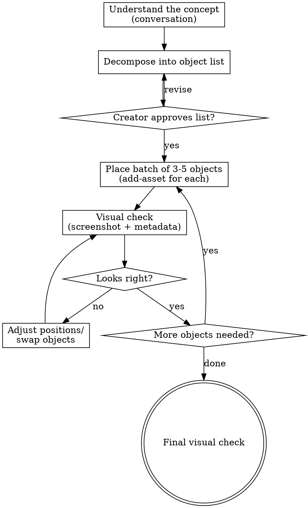

# Build

## Overview

Conversational world builder. Takes a high-level concept ("living room", "pirate ship deck", "medieval tavern"), decomposes it into concrete objects, finds them in the Creator Store, places them, screenshots to verify, and iterates until the scene feels right.

**Core principle:** Build incrementally, verify visually, iterate based on what you see. Don't try to place 20 objects blind — place 3, check, adjust, add more.

<HARD-RULE>
**Creator Store assets for EVERYTHING except structural geometry.** Floors, walls, and ceilings can be primitives (you need exact control over dimensions and openings). Everything else — furniture, props, obstacles, decorations, hazards, scenery, vehicles, creatures — MUST come from the Creator Store first. The game should look polished, not blocky. A Creator Store "lava rock" with textures and mesh detail looks 100x better than an orange Part. Search aggressively with multiple query variations before falling back to `generate_mesh`, and only use primitives as a last resort.
</HARD-RULE>

## Process Flow



## Phase 1: Understand the Concept

Start with a conversation. Ask ONE question at a time:

**Opening:**
> "I'll help you build that. Before I start pulling objects — tell me more about what you're picturing."

**Questions to explore:**
- "What's the vibe? Realistic, cartoony, gritty, cozy?"
- "How big is this space? A room? An arena? A whole island?"
- "What's the most important object in the scene — the thing the player's eye should go to first?"
- "Is this a playable area or a backdrop/decoration?"
- "Any objects you definitely want vs. ones I can improvise?"

2-3 questions is usually enough. Don't over-plan — you'll iterate visually.

## Phase 2: Decompose into Objects

Based on the conversation, create a concrete object list. Think about:

**Essential objects** (the scene doesn't read as "X" without these):
- Living room → couch, table, rug, lamp
- Medieval tavern → bar counter, stools, fireplace, wooden tables
- Race track → road, barriers, finish line, grandstands

**Atmosphere objects** (make it feel alive):
- Living room → books, picture frames, plant, curtains
- Medieval tavern → mugs, candles, weapon rack, barrels
- Race track → flags, tire stacks, pit crew equipment

**Spatial anchors** (define the boundaries):
- Living room → walls, floor, ceiling, windows
- Medieval tavern → stone walls, wooden beams, door
- Race track → fencing, terrain, spectator areas

Present the list to the creator:
> "Here's what I'm thinking for a living room:
> **Essential:** couch, coffee table, rug, floor lamp
> **Atmosphere:** bookshelf, potted plant, picture frame, throw pillows
> **Spatial:** floor, walls (or open-air?)
>
> Want to add, remove, or change anything before I start placing?"

## Phase 3: Place in Batches

Don't place everything at once. Work in batches of 3-5 objects:

1. **Start with spatial anchors** — floor/walls/ground first. These define the space.
2. **Add essential objects** — the hero pieces that make the scene readable.
3. **Add atmosphere** — the details that make it feel alive.

For each object, use the `add-asset` skill:
1. Use `insert_from_creator_store` to search and insert in one step
2. Reference the inserted model via the returned GUID tag
3. Position it relative to already-placed objects

**If Creator Store has nothing suitable**, you can generate a custom mesh with `generate_mesh` as an alternative before falling back to primitives.

**Positioning principles:**
- Place objects relative to each other, not at absolute coordinates
- Leave walkable space between furniture
- Group related objects (table + chairs together, lamp near couch)
- Anchor to walls/edges rather than floating in the middle
- Use `execute_luau` to get existing object positions before placing new ones

### Placement Helper

Use this to get a reference layout before placing:
```lua
local out = {}
for _, child in workspace:GetChildren() do
    if child:IsA("Model") or (child:IsA("BasePart") and child.Name ~= "Terrain") then
        local pos
        if child:IsA("Model") then
            local p = child.PrimaryPart or child:FindFirstChildWhichIsA("BasePart")
            if p then pos = p.Position end
        else
            pos = child.Position
        end
        if pos then
            table.insert(out, string.format("%s at (%.0f, %.0f, %.0f) size: %s",
                child.Name, pos.X, pos.Y, pos.Z,
                child:IsA("BasePart") and tostring(child.Size) or "model"))
        end
    end
end
return table.concat(out, "\n")
```

## Phase 4: Check + Visual Verify + Iterate

After each batch, do BOTH a logic check AND a visual check:

### Step 1: Run placement-check.luau

Read and execute `luau/placement-check.luau` via `execute_luau` (set `ROOM_FOLDER` to the room's folder name). This catches:
- **Floating objects** — not grounded and nothing supporting them underneath
- **Wall clipping** — bounding box extends through walls
- **Object overlap** — two objects occupying the same space
- **Odd rotation** — not aligned to room axes (0/90/180/270) unless intentional
- **Scale outliers** — way too big or small relative to other objects

Fix any issues found BEFORE taking a screenshot. Common fixes:
- Clipping through wall → move object 2-3 studs away from the wall
- Floating → lower Y position to sit on the floor or on the object below
- Odd rotation → snap to nearest 90-degree increment
- Scale mismatch → `model:ScaleTo(factor)`

### Step 2: Visual check (screenshot)

Use the `screenshot` skill with `luau/smart-camera.luau` to frame the scene.
Set `TARGET` to a central object or take multiple shots from different angles.

Then use the `screen_capture` MCP tool to capture the viewport.

The screenshot catches things the logic check can't:
- Does the scene **read** as what the creator asked for?
- Is there a **focal point** the eye goes to?
- Does the **spacing** feel right? Too crammed? Too sparse?
- Do the **colors/materials** work together?
- Does anything look **weird** that the bounding box check missed? (Mesh models can look wrong even with correct bounding boxes)

### Step 3: Multi-angle visual sweep

After the logic check passes, do a visual sweep from multiple perspectives:

1. **Focus on each newly placed object** — use `luau/smart-camera.luau` with `TARGET = "ObjectName"`, then `screen_capture`, check for sub-part alignment issues (books on shelves, legs on ground, etc.)

2. **Room overview shot** — camera high and back to see the whole scene, check overall composition and spacing

3. **Player perspective** — camera at spawn position + head height, looking into the room. This is what the player actually sees.

For each screenshot, look for:
- Sub-parts misaligned (hanging off edges, clipping through surfaces)
- Scale mismatches between objects
- Objects facing wrong direction (back of couch facing the room)
- Gaps that look wrong (furniture too far from walls, floating slightly above floor)
- Color/material coherence

### Step 4: Fix and iterate

**Logic issues** (from placement-check): fix programmatically via `execute_luau`
**Visual issues** (from screenshots): reposition, rotate, adjust sub-parts, swap assets

**The 90/10 rule:** 90% of placement issues (clipping, floating, rotation, scale) are caught and fixed by code. The screenshots catch the last 10% that only eyes can see — sub-part alignment, aesthetic feel, composition.

**Max 2 visual fix rounds per batch.** After that, share with the creator:
> "Here's what I have so far — [describe what you placed]. I fixed [N] issues (clipping, floating, alignment). Take a look — what should I adjust?"

Don't chase perfection. Get to 80%, then let the creator fine-tune.

**Share with the creator:**
> "Here's what I have so far — [describe what you placed and where]. Take a look. What should I adjust?"

## Phase 5: Iterate Until Happy

Repeat Phase 3-4 until:
- The creator says it looks good
- OR you've done 3 visual check rounds (don't over-iterate — hand it off for manual tweaking)

On handoff:
> "Here's the scene so far. I've placed [N] objects. You'll probably want to fine-tune positions manually — drag things around in Studio until it feels right. The AI got you 80% there, the last 20% is your taste."

## Multi-Room Scenes: Sub-Agent Delegation

For scenes with multiple distinct areas (dungeon rooms, house floors, city blocks), delegate each area to a **sub-agent** that builds it independently with full attention.

### Coordinator Flow (main agent)

```
1. Design overall layout with creator (conversation)
2. Define rooms: theme, object list, coordinate boundaries
3. Build connecting corridors/structure yourself
4. For each room (SEQUENTIALLY):
   a. Spawn sub-agent with room-builder-prompt.md
   b. Give it: room theme, objects, coordinates, materials
   c. Sub-agent builds, checks, screenshots, iterates
   d. Sub-agent reports back
   e. Main agent reviews, makes cross-room adjustments
5. Final walkthrough: screenshot from player path perspective
6. Share with creator
```

### Sub-Agent Prompt

Use `skills/build/room-builder-prompt.md` as the base prompt for each sub-agent. Append the room-specific details:

```
You are building Room N: "[Theme Name]"

Coordinate boundaries: X=[min to max], Z=[min to max], floor Y=[Y], ceiling Y=[Y]
Room folder: workspace.[ParentFolder].[RoomFolder]

Objects to place:
- [object 1] — [placement notes]
- [object 2] — [placement notes]
...

Materials/colors for this room:
- Walls: [material, color]
- Floor: [material, color]
- Accent: [color]

Gems to hide (if applicable):
- [N] gems in this room, hidden at [suggested locations]
```

### Why Sequential (Not Parallel)

- MCP only handles one `execute_luau` at a time
- Screenshot capture requires the camera to be positioned for ONE room
- Each room gets full visual verification attention
- Cross-room issues (scale consistency, style coherence) checked between rooms

## Roblox Implementation Notes

### Moving Platforms

If placing platforms that move (conveyor belts, elevators, sliding platforms), they MUST use the TweenService + AssemblyLinearVelocity pattern or players will slide off. See `skills/mechanics-designer/SKILL.md` → "Roblox Implementation Notes" for the full code pattern. Do NOT use BodyVelocity, AlignPosition, or raw CFrame updates — those don't carry players.

## Key Principles

- **Batch and verify.** Never place more than 5 objects without looking.
- **Start with structure, end with detail.** Floor before furniture, furniture before decoration.
- **The creator's vision is primary.** Ask what they want, don't assume.
- **80% is the goal.** Get the scene to a good starting point. Manual tweaking finishes it.
- **Scale is everything.** One oversized object ruins the whole scene. Always check.
- **Search before you guess** on Creator Store queries. Try multiple search terms.
- **Always check play mode** before making changes.
- **Delegate rooms to sub-agents** for multi-room scenes. Each room gets full attention.
