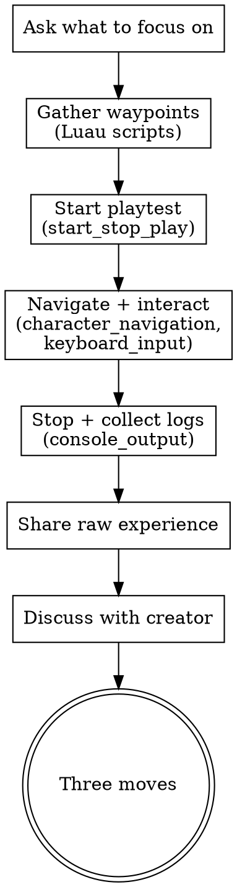

# Playtest Audit

## Overview

AI plays the Roblox experience via MCP tools and reports on the experience from a player's perspective. Navigates the space, interacts with objects, and evaluates the first-time player experience.

**Core principle:** Play first, then ask what the creator intended. The value is in the gap between "what I experienced" and "what you designed."

## When to Use

- Creator wants to see their game played by a fresh pair of eyes
- Creator wants to test difficulty, pacing, or first-time experience
- After game-design-audit or spatial-flow to add experiential data
- Creator says "play my game and tell me what you think"

## Process Flow



## Phase 1: Pre-Play Conversation

Before playing, ask the creator:

> "I'm going to play through your experience as if I'm a brand new player. Before I do — is there anything specific you want me to pay attention to? A particular section, a mechanic you're unsure about, or just a general 'play it cold' run?"

This sets expectations and helps you focus.

## Phase 2: Gather Navigation Plan

1. Execute `luau/spatial-analysis.luau` via `execute_luau` — spawn + landmark positions
2. Execute `luau/difficulty-curve.luau` via `execute_luau` — platform gaps and difficulty

**Important:** `execute_luau` returns the **return value**, not print output.

These give waypoints: spawn → nearest landmark → next landmark → etc.

## Phase 3: Play

1. `start_stop_play` to begin
2. `character_navigation` to each waypoint in order
3. At each stop: `keyboard_input` (spacebar to jump), `mouse_input` (click nearby objects)
4. Check position between moves:

```lua
local player = game.Players:GetPlayers()[1]
if player and player.Character then
    local hrp = player.Character:FindFirstChild("HumanoidRootPart")
    if hrp then
        local hum = player.Character:FindFirstChild("Humanoid")
        return "Player position: " .. tostring(hrp.Position) .. "\nPlayer alive: " .. tostring(hum and hum.Health > 0)
    else
        return "Player has no HumanoidRootPart — may have died"
    end
else
    return "No player character found"
end
```

5. If stuck (character hasn't moved >5 studs toward target), log it and move on
6. After 60 seconds or all waypoints visited: `start_stop_play` to stop
7. `console_output` for the full session log

## Phase 4: Share the Experience

Tell the creator what happened as a NARRATIVE, not a data dump:

> "Here's what I experienced as a new player: I spawned facing [direction]. The first thing I saw was [object]. I walked toward [target] and [what happened]. The first jump was [difficulty assessment]. Then..."

This is the most valuable part — the creator hears their game described from a fresh perspective.

## Phase 5: Discuss

Ask the creator:
- "Was that the experience you were going for?"
- "The part where [specific moment] — was that intentional?"
- "I got stuck at [location] — is that a known issue or something to look at?"

Then deliver Three Moves — specific, actionable, connected to what you experienced.

## Difficulty Benchmarks (Roblox Obbies)

- Easy jump: 4-8 studs
- Medium: 8-14 studs
- Hard: 14-20 studs
- Expert: 20+ studs

## Roblox-Specific Knowledge

**You are NOT a Roblox expert — the DevForum is.** When you encounter unexpected behavior during playtesting, or when the creator reports that a suggested fix doesn't work:

1. **Do NOT iterate blindly.** Stop guessing after one failed attempt.
2. **Search immediately.** Use web search for the specific problem (e.g., "Roblox character_navigation not working MCP site:devforum.roblox.com"). The DevForum almost always has a working solution.
3. **Cite your source.** Share the link so the creator can verify.
4. **Roblox APIs change frequently.** Filter for recent posts (2024+).

This is especially important for playtesting — MCP tools like `character_navigation`, `keyboard_input`, and `start_stop_play` have specific behaviors and limitations that may not be obvious. Search first, experiment second.

## Key Principles

- **Play before you judge.** Experience it, then ask about intent.
- **Narrate, don't data-dump.** "I fell off platform 3" > "character Y < 0 at t=12s"
- **The gap between intent and experience is the insight.** Surface it, don't evaluate it.
- **Navigation failure is data, not a verdict.** If you can't reach something, say so — the creator decides if that's a problem.
- **Search before you guess.** If a Roblox implementation doesn't work, search the DevForum.
