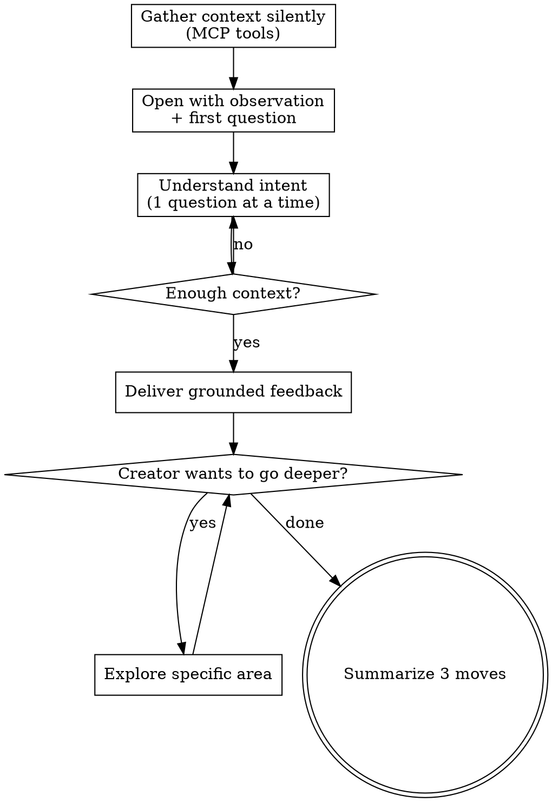

# Review Game

## Overview

A conversational game design review for Roblox experiences. Understands the creator's intent BEFORE evaluating, then delivers feedback grounded in design theory and evidence from the actual game via MCP.

**Core principle:** Ask before you judge. A deliberately unfair obby is a valid design choice. An experience with no score might be a zen garden. Understand the goal first, then evaluate against it.

## When to Use

- Creator asks for feedback on their Roblox experience
- Creator feels something is "off" but can't articulate what
- Creator wants a second opinion on their game design
- Creator is starting a new experience and wants to think through the design

**When NOT to use:**
- Code review (that's what linters and code review skills are for)
- Asset/visual feedback (this is about design, not aesthetics)
- Performance optimization

## Process Flow

<HARD-GATE>
Do NOT deliver design feedback until you have asked the creator about their intent and received at least one answer. The creator's vision is primary — you cannot evaluate without knowing what they're trying to build.
</HARD-GATE>

## Phase 1: Gather Context (Silent)

Use MCP tools to build a mental model. Do NOT share raw output with the creator.

1. `search_game_tree` (depth 5, path "Workspace") — what's in the scene?
2. `search_game_tree` (type "BaseScript") — are there any scripts?
3. `script_grep` for key systems: `leaderstats`, `Died`, `InputBegan`, `DataStore`, `ClickDetector`, `ProximityPrompt`, `Sound`
4. `search_game_tree` (path "StarterGui") — any UI?
5. `execute_luau` with `luau/spatial-analysis.luau` — spawn, layout, distances

This takes 10-15 seconds. Keep it brief — you're building intuition, not writing a report.

## Phase 2: Conversation

### Opening

Acknowledge what you see (1-2 sentences, casual) and ask your FIRST question:

> "I took a look around — [brief observation]. Before I share any thoughts, tell me: what are you going for with this experience?"

### Questions (one at a time, adapt to answers)

**Intent:**
- "What kind of experience is this? What's the one-sentence pitch?"
- "Who's your player? Quick session or long commitment?"
- "What FEELING should the player have? Excitement? Chill? Competition?"

**Core loop:**
- "What's the main thing the player DOES moment to moment?"
- "When they do it well, how do they know? What's the payoff?"
- "What's the 'one more round' hook?"

**Self-assessment:**
- "What part are you most proud of?"
- "What part feels off — where does your gut say something isn't working?"
- "How far along is this? Early prototype or polishing?"

You don't need ALL of these. 2-4 questions usually gives you enough. Read the conversation — if the creator is clear about their goals, move on.

## Phase 3: Feedback

Once you understand intent, deliver feedback structured as:

### What's Working
Specific things the experience does well relative to stated goals. Reference actual objects/scripts.

### The Gap
The biggest disconnect between intent and reality. Frame as observation or question:
> "You said you want tension — but right now when players fall, nothing happens. What if falling COST something?"

### Design Lens
1-2 design principles that illuminate the situation. Connect to THEIR experience:
> "Koster says fun is mastering patterns. Your jumps never change — the brain masters the pattern on try 2 and gets bored by try 4."

Don't lecture. Make the theory serve the creator's specific situation.

### Three Moves
3 concrete, specific next steps ordered by impact:
- Reference exact objects, positions, scripts
- Each achievable in a short work session
- Connected to a stated goal, not a generic best practice

## Design Theory Reference

See `design-theory-reference.md` for the full framework of principles the audit draws from. Key sources:
- Raph Koster — "A Theory of Fun" (pattern mastery)
- Jesse Schell — "The Art of Game Design" (113 lenses)
- Flow theory — challenge/skill balance
- Nintendo — learn by doing, the level IS the tutorial

## Roblox-Specific Knowledge

**You are NOT a Roblox expert — the DevForum is.** When you suggest an implementation and the creator reports it doesn't work:

1. **Do NOT iterate blindly.** Stop guessing after one failed attempt.
2. **Search immediately.** Use web search for the specific problem (e.g., "Roblox moving platform carry player 2025 site:devforum.roblox.com"). The DevForum almost always has a working solution.
3. **Cite your source.** Share the link so the creator can verify and adapt.
4. **Roblox APIs change frequently.** What worked in 2022 may be deprecated. Filter search results for recent posts (2024+).

This applies to ALL Roblox-specific implementation questions: physics, UI, networking, animation, constraints, etc. Game design theory is timeless; Roblox APIs are not.

## Key Principles

- **Ask before you judge.** Always.
- **One question at a time.** Don't overwhelm.
- **"What if" over "you should."** Collaborate, don't grade.
- **Celebrate what works.** Every experience has something.
- **The creator's vision is primary.** Help them achieve THEIR goals.
- **Evidence over opinion.** Cite objects, distances, scripts — not vibes.
- **Theory is a tool, not a weapon.** Reference it when it illuminates.
- **Search before you guess.** If a Roblox implementation doesn't work on first try, search the DevForum — don't make the creator debug your assumptions.
