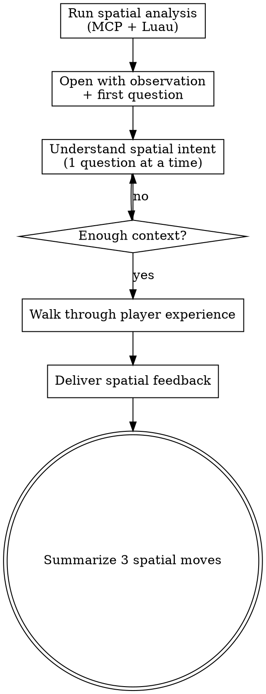

# Review Layout

## Overview

Analyze how players move through a Roblox experience — spawn orientation, sightlines, path clarity, dead ends, and affordance traps. Conversational, not a dump.

**Core principle:** The player doesn't have your mental model. What's obvious to the creator is invisible to a new player. Help the creator see their space through fresh eyes.

## When to Use

- Creator asks about layout, navigation, or spatial design
- Creator reports "players get lost" or "players don't know where to go"
- Creator wants feedback on spawn placement or level flow
- Part of a broader game design audit (can be invoked by `review-game`)

## Process Flow



<HARD-GATE>
Do NOT deliver spatial feedback until you have asked the creator about their intended player path and received at least one answer. A confusing layout might be intentional (horror, puzzle, exploration). Understand first.
</HARD-GATE>

## Phase 1: Gather Spatial Data (Silent)

1. Read and execute `luau/spatial-analysis.luau` via `execute_luau` — spawn position, orientation, distances
2. Read and execute `luau/interaction-map.luau` via `execute_luau` — interactive objects, affordance traps
3. Execute sightline check via `execute_luau`:

```lua
local spawn = workspace:FindFirstChildWhichIsA("SpawnLocation", true)
if not spawn then return "No spawn found" end
local out = {}
local visible = {}
for _, desc in workspace:GetDescendants() do
    if desc:IsA("BasePart") and desc.Size.Magnitude > 10 then
        local dist = (desc.Position - spawn.Position).Magnitude
        if dist < 100 then
            table.insert(visible, {name = desc.Name, dist = math.floor(dist), size = tostring(desc.Size)})
        end
    end
end
table.sort(visible, function(a, b) return a.dist < b.dist end)
table.insert(out, "Large objects within 100 studs of spawn:")
for i, v in visible do
    if i <= 15 then
        table.insert(out, string.format("  %s — %d studs away, size %s", v.name, v.dist, v.size))
    end
end
return table.concat(out, "\n")
```

4. Use `search_game_tree` for SpawnLocations (checkpoints), Teleport parts, or named waypoints

**Important:** `execute_luau` returns the **return value**, not print output.

## Phase 2: Conversation

### Opening
Brief observation about the space + first question:

> "I mapped out your space — [brief observation about layout, distances, what stands out]. Let me ask: when a player first spawns in, what do you want them to see?"

### Questions (one at a time)

**Intended flow:**
- "What's the intended path? Linear, branching, or open exploration?"
- "Is there a destination the player is moving toward?"
- "Where should the player's eye go first when they spawn?"

**Specific objects:**
- "I see [object name] — what role does it play? Landmark? Reward? Decoration?"
- "How do you want players to discover [area/object]? Guided or stumbled upon?"

**Feel:**
- "What's the pacing? Constant action or moments of calm?"
- "How big should this feel? Intimate or epic?"

2-3 questions is usually enough for spatial feedback.

## Phase 3: Spatial Feedback

### The First 5 Seconds
Describe what actually happens when a player spawns. What direction they face, what they see, how far the first landmark is. Compare to the creator's intent.

### The Path
Trace the critical path. Note distances between landmarks, dead ends, visual hierarchy.

### Affordance Check
Flag anything that looks interactive but isn't (or vice versa). Frame as a question:
> "MysteryDoor has a bright red panel — players will try to click it. Is that intentional?"

### Three Spatial Moves
3 specific changes with exact objects/positions/rotations. Each connected to the creator's stated goals.

## Roblox-Specific Knowledge

**You are NOT a Roblox expert — the DevForum is.** When you suggest a spatial change or implementation and the creator reports it doesn't work:

1. **Do NOT iterate blindly.** Stop guessing after one failed attempt.
2. **Search immediately.** Use web search for the specific problem (e.g., "Roblox spawn orientation facing wrong direction site:devforum.roblox.com"). The DevForum almost always has a working solution.
3. **Cite your source.** Share the link so the creator can verify.
4. **Roblox APIs change frequently.** Filter for recent posts (2024+).

## Key Principles

- **Spawn is the most important moment.** First 5 seconds set every expectation.
- **Players follow their eyes.** Big, bright, high-contrast = magnet.
- **Every dead end is a broken promise.**
- **Affordance traps destroy trust.** If it looks clickable, it should be.
- **The creator's spatial intent is primary.** A maze is supposed to be confusing.
- **Search before you guess.** If a Roblox implementation doesn't work, search the DevForum.
